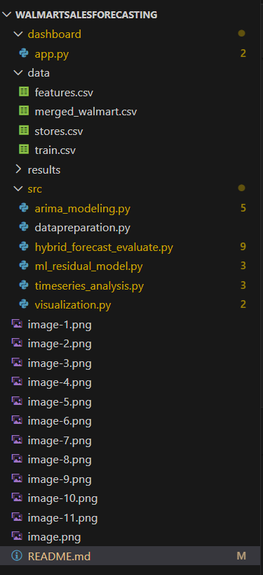

# Walmart Sales Forecasting — Hybrid ARIMA + Machine Learning

A complete end-to-end weekly sales forecasting system using **ARIMA/SARIMAX**, **XGBoost**, and a **Hybrid (ARIMA + ML on residuals)** approach on the famous Walmart Recruiting - Store Sales Forecasting dataset.

Includes exploratory analysis, modular pipeline, comprehensive evaluation metrics, publication-ready visualizations, and an interactive **Streamlit dashboard**.

## 🚀 Project Overview

This project implements a state-of-the-art hybrid forecasting framework:

1️⃣ **Classical Model (SARIMAX)**  
   → Captures trend, 52-week seasonality, autocorrelation

2️⃣ **Machine Learning Model (XGBoost)**  
   → Learns non-linear patterns, holiday effects, external regressors, lag/rolling features

3️⃣ **Hybrid Model**  
Final Forecast = SARIMAX_Forecast + XGBoost_Predicted_Residuals
Proven to outperform standalone ARIMA and pure ML models.

## 📁 Project Structure
                     

## 📊 Features Implemented
- Data preprocessing, merging datasets, handling missing values  
- Engineered lag features (1, 2, 52 weeks) & rolling statistics (4, 8, 52 weeks)  
- Added holiday flags and time-based features  
- Full exploratory data analysis (EDA) with trend & seasonality decomposition  
- ACF/PACF plots and rolling statistics visualization  
- Stationarity testing using Augmented Dickey-Fuller (ADF)  
- Automated SARIMAX parameter selection with `auto_arima`  
- SARIMAX model fitting with exogenous variables  
- Residual extraction and diagnostics from SARIMAX  
- XGBoost regressor trained on SARIMAX residuals  
- Hyperparameter tuning using `RandomizedSearchCV`  
- Hybrid forecasting: `Final Forecast = SARIMAX + XGBoost(Residuals)`  
- Comprehensive evaluation with multiple metrics (RMSE, MAE, MAPE, sMAPE, MASE, wMAPE)  
- Publication/thesis-ready visualizations  
- Actual vs Forecast plots with confidence intervals  
- Residual analysis (ACF/PACF of hybrid errors)  
- Feature importance plots from XGBoost  
- Interactive Streamlit dashboard with multiple pages  
- Fully modular, reusable, and well-documented pipeline

### Evaluation Metrics (saved in `results/phase6_metrics.csv`)
- RMSE · MAE · MAPE · sMAPE · MASE · wMAPE

## 🛠 Technologies Used

| Category              | Tools                                      |
|-----------------------|--------------------------------------------|
| Language              | Python                                           |
| Statistical Modeling  | `statsmodels`, `pmdarima`                        |
| Machine Learning      | `XGBoost`, `scikit-learn`                         |
| Visualization         | `Matplotlib`, `Seaborn`, `Plotly`                |
| Dashboard             | `Streamlit`                                      |
| Data Handling         | `Pandas`, `NumPy`                                |

## ▶ How to Run the Project

```bash
# 1. Clone the repository
git clone https://github.com/Dhyaneswar225/Walmart-Sales-Forecasting-using-Hybrid-Arima-and-xgboost.git
cd WALMARTSALESFORECASTING

# 2. Install dependencies
pip install pandas numpy matplotlib seaborn statsmodels pmdarima xgboost scikit-learn plotly streamlit

# 3. Prepare merged dataset
python src/datapreparation.py

# 4. Run Timeseries
python src/timeseries_analysis.py

# 5. Run ARIMA/SARIMAX model
python src/arima_modeling.py

# 6. Train XGBoost on residuals
python src/ml_residual_model.py

# 7. Generate hybrid forecasts & evaluation
python src/hybrid_forecast_evaluate.py

# 8. Create all thesis/publication plots
python src/visualization.py

# 9. Launch interactive dashboard
streamlit run dashboard/app.py
```
## Data Exploration


## ARIMA model results


## Hybrid Model Results


## Error Comparision

