# Walmart Sales Forecasting — Hybrid ARIMA + Machine Learning

A complete end-to-end weekly sales forecasting system using **ARIMA/SARIMAX**, **XGBoost**, and a **Hybrid (ARIMA + ML on residuals)** approach on the famous Walmart Recruiting - Store Sales Forecasting dataset.

Includes exploratory analysis, modular pipeline, comprehensive evaluation metrics, publication-ready visualizations, and an interactive **Streamlit dashboard**.

🚀 Live Demo: [https://walmart-hybrid-forecast.streamlit.app](https://walmart-hybrid-forecast.streamlit.app) *(if deployed)*

## 🚀 Project Overview

This project implements a state-of-the-art hybrid forecasting framework:

1️⃣ **Classical Model (SARIMAX)**  
   → Captures trend, 52-week seasonality, autocorrelation

2️⃣ **Machine Learning Model (XGBoost)**  
   → Learns non-linear patterns, holiday effects, external regressors, lag/rolling features

3️⃣ **Hybrid Model**  
Final Forecast = SARIMAX_Forecast + XGBoost_Predicted_Residuals
Proven to outperform standalone ARIMA and pure ML models.

## 📁 Project Structure
WALMARTSALESFORECASTING/
│
├── dashboard/
│   └── app.py                        # Streamlit dashboard
│
├── data/
│   ├── features.csv
│   ├── merged_walmart.csv            # Cleaned + merged dataset
│   ├── stores.csv
│   └── train.csv
│
├── results/                          # All generated outputs
│   ├── arima_insample.csv
│   ├── arima_forecast.csv
│   ├── phase6_metrics.csv
│   ├── phase6_forecasts_compare.csv
│   ├── phase6_resid_feature_importance.png
│   └── ...                      
│
├── src/                              # Core processing modules
│   ├── arima_modeling.py
│   ├── datapreparation.py
│   ├── hybrid_forecast_evaluate.py
│   ├── ml_residual_model.py
│   ├── timeseries_analysis.py
│   └── visualization.py
│
└── README.md                         

## 📊 Features Implemented
Data preprocessing, merging, lag/rolling features, holiday flags 
Full EDA: trend, seasonality, ACF/PACF, rolling stats 
Stationarity tests, auto_arima, SARIMAX fitting, residual export 
XGBoost on SARIMAX residuals with RandomizedSearchCV tuning 
Hybrid forecast generation & comprehensive evaluation 
Publication-quality plots (actual vs forecast, feature importance, etc.) 

### Evaluation Metrics (saved in `results/phase6_metrics.csv`)
- RMSE · MAE · MAPE · sMAPE · MASE · wMAPE

## 🛠 Technologies Used

| Category              | Tools                                      |
|-----------------------|--------------------------------------------|
| Language              | Python                                           |
| Statistical Modeling  | `statsmodels`, `pmdarima`                        |
| Machine Learning      | `XGBoost`, `scikit-learn`                         |
| Visualization         | `Matplotlib`, `Seaborn`, `Plotly`                |
| Dashboard             | `Streamlit`                                      |
| Data Handling         | `Pandas`, `NumPy`                                |

## ▶ How to Run the Project

```bash
# 1. Clone the repository
git clone https://github.com/yourusername/WALMARTSALESFORECASTING.git
cd WALMARTSALESFORECASTING

# 2. Install dependencies
pip install -r requirements.txt

# 3. Prepare merged dataset
python src/datapreparation.py

# 4. Run ARIMA/SARIMAX model
python src/arima_modeling.py

# 5. Train XGBoost on residuals
python src/ml_residual_model.py

# 6. Generate hybrid forecasts & evaluation
python src/hybrid_forecast_evaluate.py

# 7. Create all thesis/publication plots
python src/visualization.py

# 8. Launch interactive dashboard
streamlit run dashboard/app.py

##Dashboard
##Data Exploration
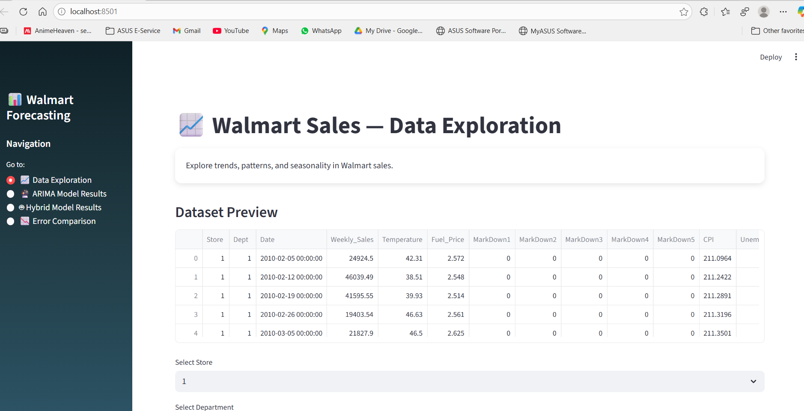
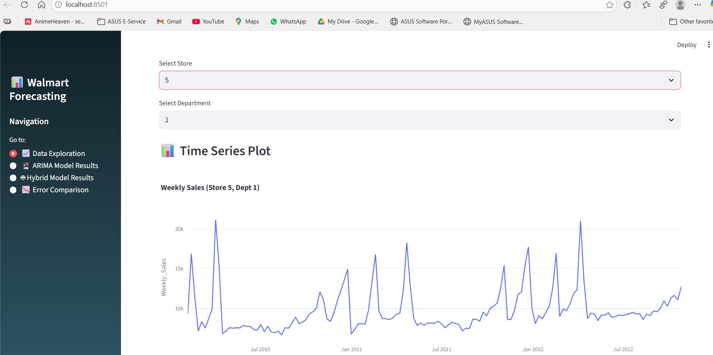
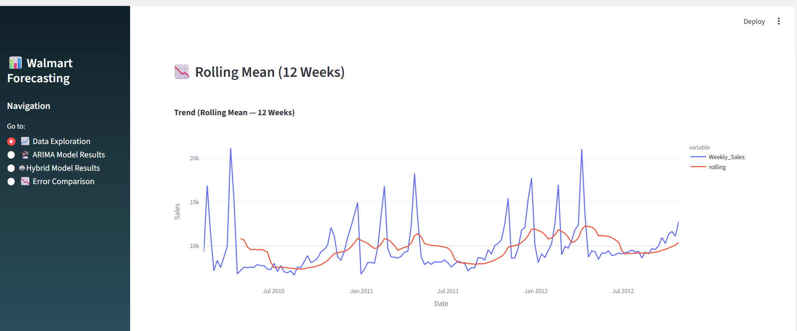
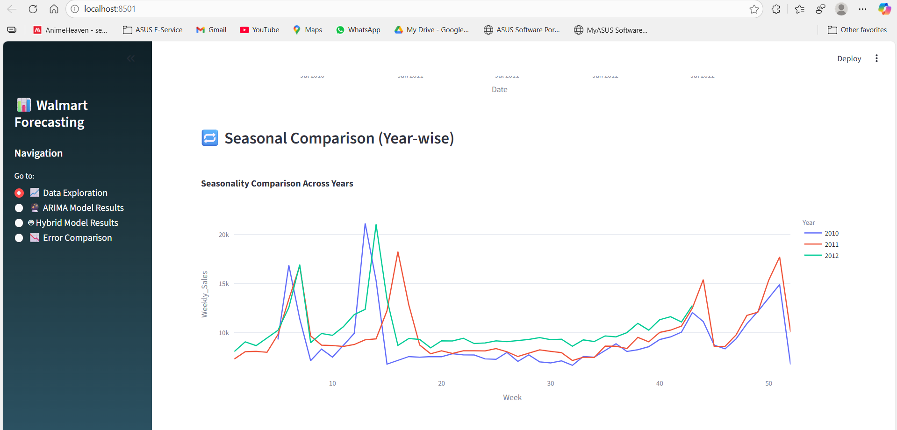

##ARIMA model results
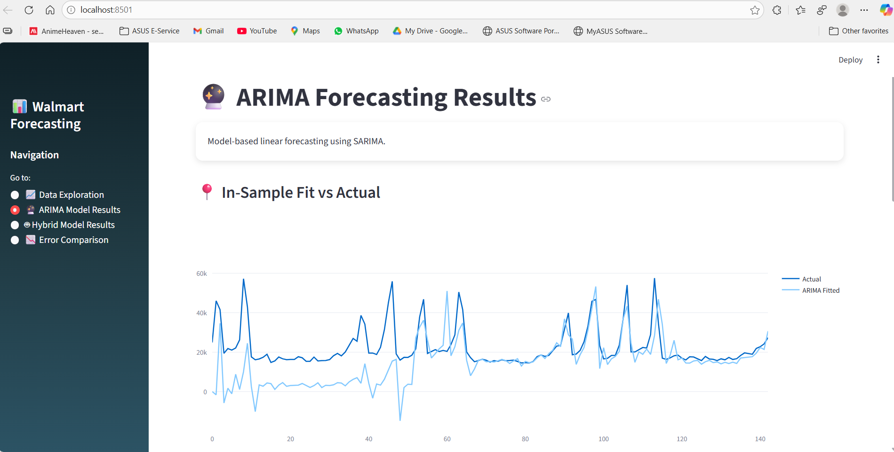
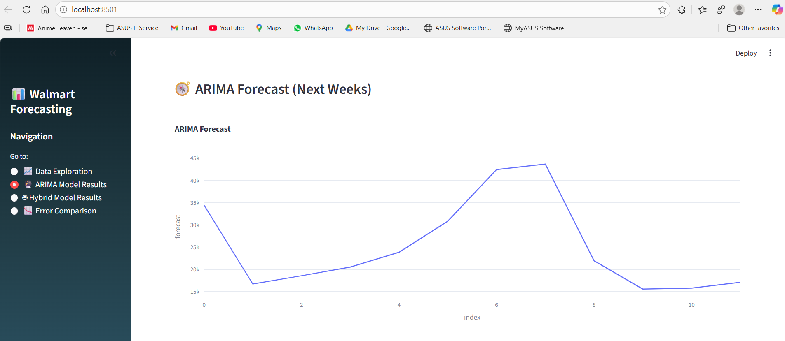
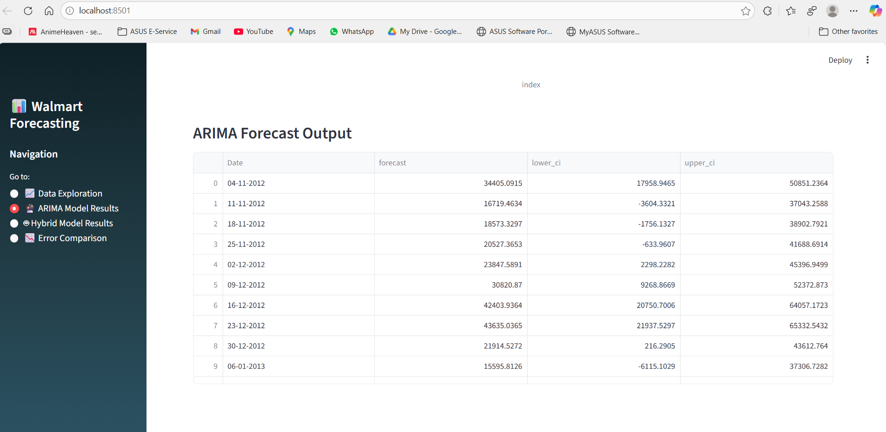

##Hybrid Model Results
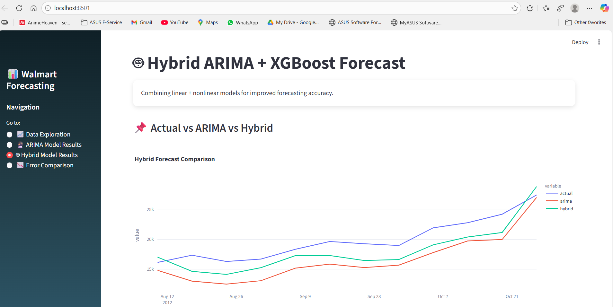
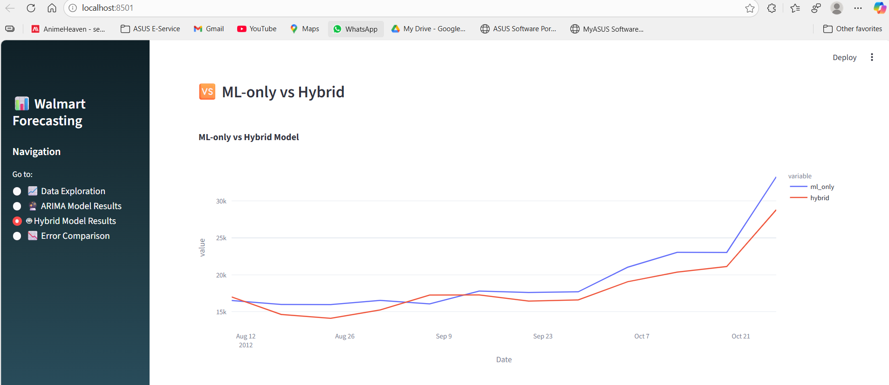
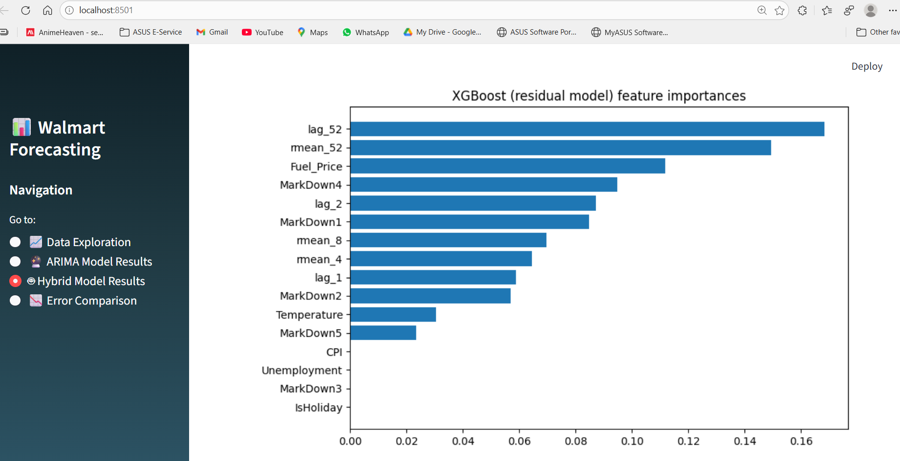

##Error Comparision
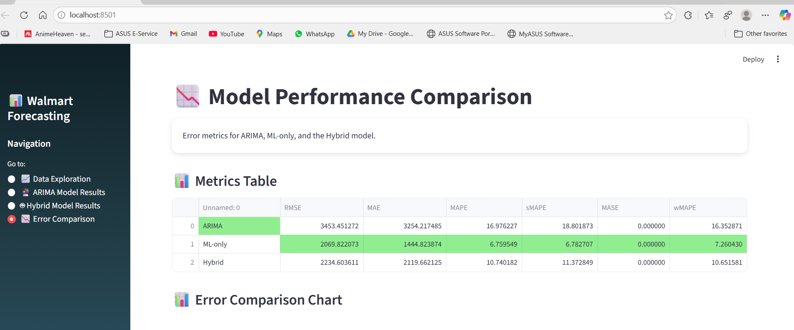
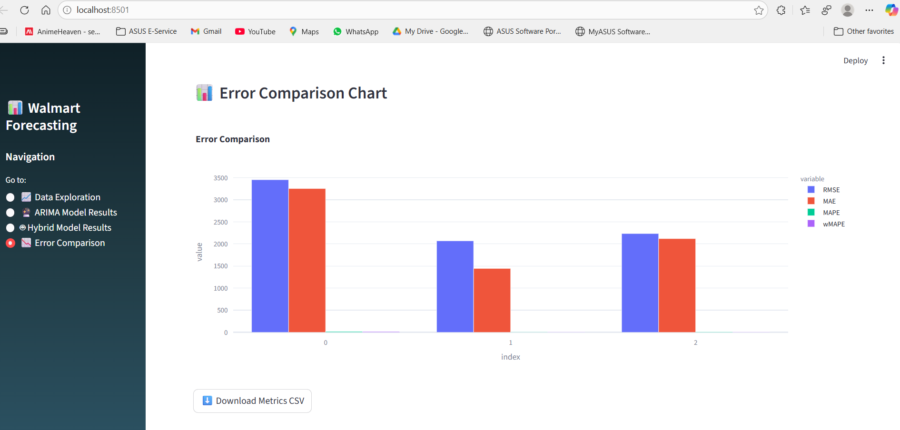